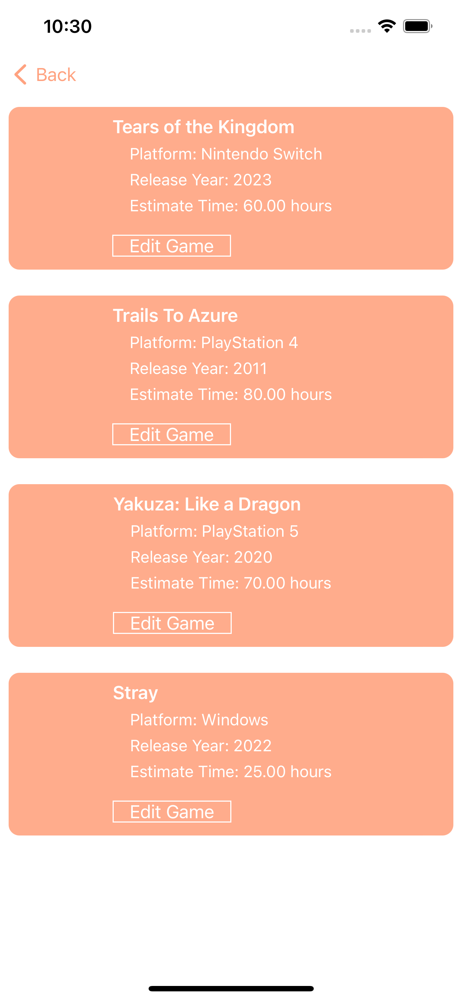
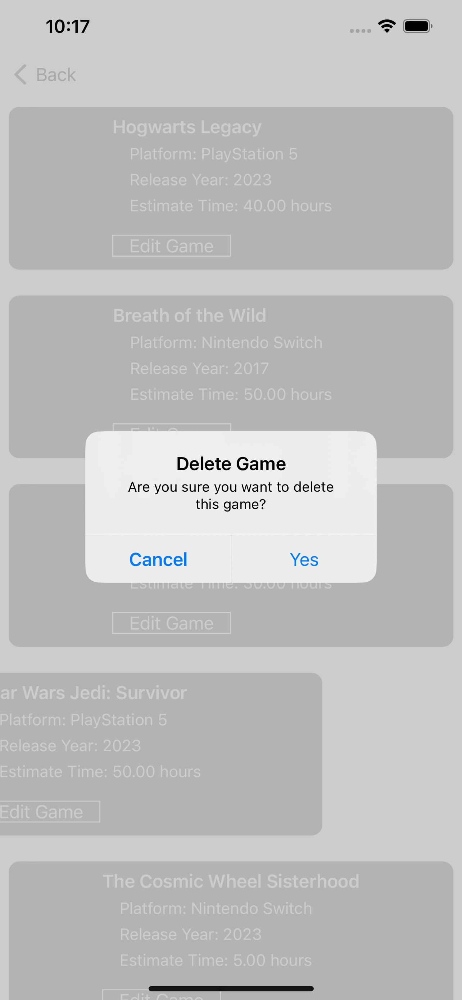
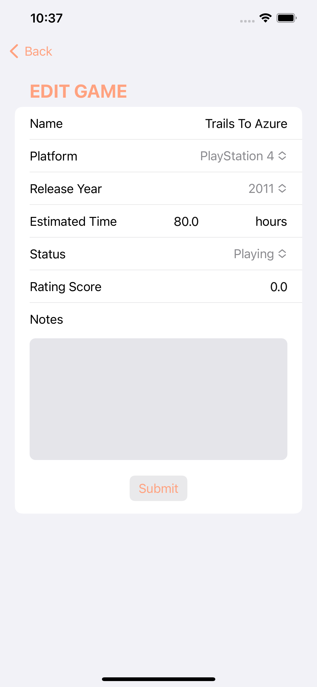
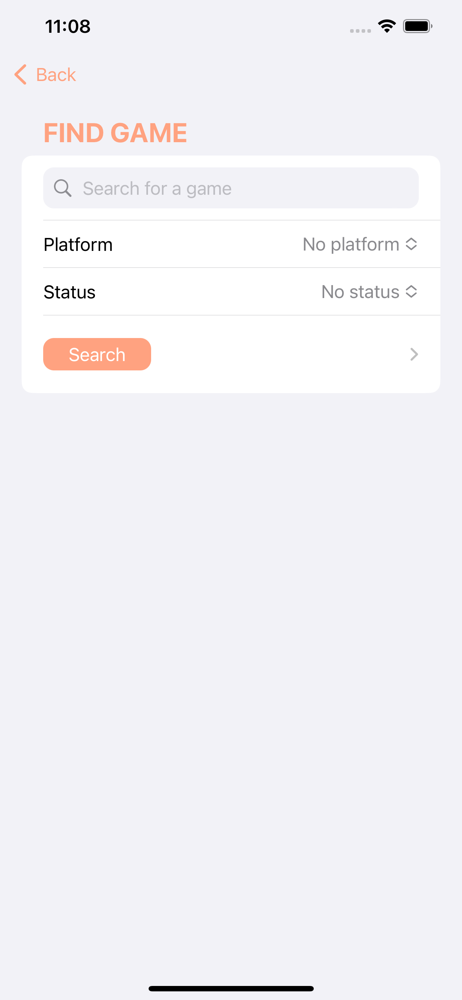

# My Game Plan - Organize Your Gaming Journey
My Game Plan, your companion for managing your gaming adventures. This SwiftUI-powered app, integrated with Core Data, empowers users to curate, track, and enhance their gaming experiences. Say goodbye to the hassle of remembering every game you want to play; let My Game Plan do the work for you. It's never been easier to curate your gaming future. 
<kbd></kbd>&nbsp;&nbsp;&nbsp;&nbsp;
<kbd></kbd>
# Add Game View
Seamlessly add the games you're excited to play to your personal list. My Game Plan's intuitive interface makes it easy to keep track of your gaming backlog. 
<kbd></kbd>&nbsp;&nbsp;&nbsp;&nbsp;
<kbd></kbd>
# Delete a Game
If you're no longer interested in a particular game, simply swipe left on the game's listing, and it will be removed from your collection.  
<kbd></kbd>
# Edit a Game
Whether it's correcting details, changing the game's status, or updating important notes, this functionality provides a quick way to maintain an accurate and personalized game list. Users can effortlessly modify game attributes, ensuring their gaming plans remain organized and up-to-date. 
<kbd></kbd>
# Search a Game
Tailor your game list by applying filters based on platform, release year, and status. Whether you're searching for games on a specific console, released in a particular year, or sorted by their play status, this feature enables you to find the games that matter most to you. Keep your gaming plans organized and efficient with the ability to hone in on the games that match your criteria. 
<kbd></kbd>