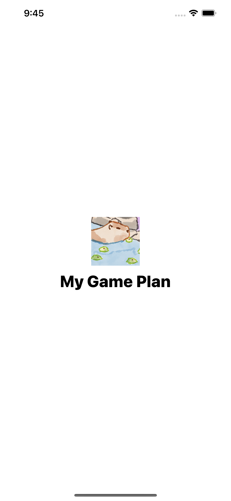
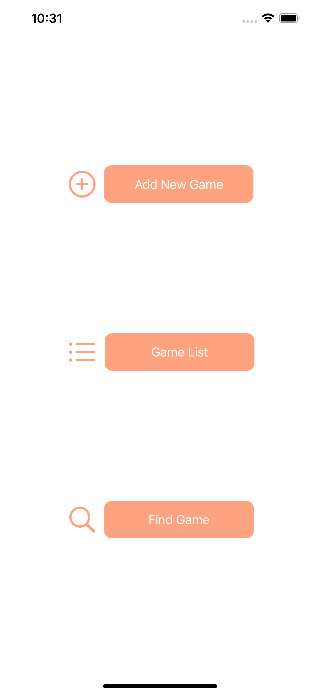
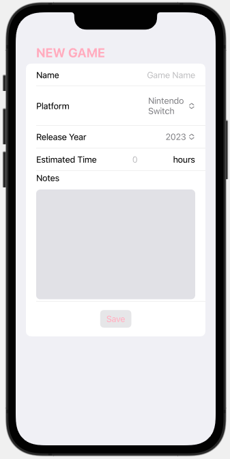

# My Game Plan - Organize Your Gaming Journey
My Game Plan, your companion for managing your gaming adventures. This SwiftUI-powered app, integrated with Core Data, empowers users to curate, track, and enhance their gaming experiences. Say goodbye to the hassle of remembering every game you want to play; let My Game Plan do the work for you. It's never been easier to curate your gaming future. 

# Add Game View
Seamlessly add the games you're excited to play to your personal list. My Game Plan's intuitive interface makes it easy to keep track of your gaming backlog.  

# To Do Features
* Game list with filter
* Delete a game
* User can change a game's status to "Finished" and give the game a rating score when they finish it
